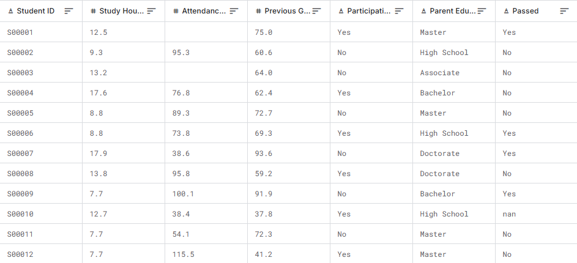
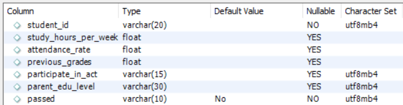

# StudentPerformanceETL
## Các thư viện được sử dụng
Có thể cần cài đặt các thư viện pandas, numpy, kaggle, schedule, mysql-connector
```bash
pip install pandas numpy kaggle schedule mysql-connector-python
```
## Cấu trúc dự án
Dự án bao gồm 2 module chính:
* sql: Chứa các module nhỏ hơn để xử lý việc đọc các câu lệnh SQL.
* business: Chứa các nghiệp vụ của hệ thống, các model và dao.
Về vai trò của từng file:
* [main.py](main.py): file chính của dự án
* [sql_reader.py](sql/sql_reader.py): Chứa lớp `SQLFileReader` để đọc các truy vấn từ file sql.
* [field.py](business/field.py): Chứa tên các trường để các module khác cùng sử dụng.
* [model.py](business/model.py): Chứa Data Model để đại diện cho thực thể dữ liệu.
* [dao.py](business/dao.py): Chứa các DAO(Data Access Object) trợ giúp việc thao tác với CSDL.
* [etl.py](business/etl.py): Chứa các phương thức để thực hiện một quy trình ETL
* [DA with Student Performance Dataset.ipynb](business/DA%20with%20Student%20Performance%20Dataset.ipynb): Phân tích dữ liệu
* [etl_log.log](business/etl_log.log): Chứa các log ghi lại hoạt động của các quy trình ETL

## Dữ liệu
### Nguồn dữ liệu
Dữ liệu được lấy từ nguồn [Student_Performance_Dataset](https://www.kaggle.com/datasets/souradippal/student-performance-prediction)
Bao gồm các trường dữ liệu:
* `Student ID`: ID của học sinh
* `Study hours per week`: Số giờ học mỗi tuần của học sinh (average)
* `Attendance rate`: Tỉ lệ tham gia các buổi học của học sinh.
* `Previous grade`: Điểm thi lần trước của học sinh.
* `Participate on extracurricular activities`: Đánh dấu học sinh có tham gia hoạt động ngoại khóa hay không?
* `Parent education level`: Trình độ học vấn của cha mẹ.
* `Passed`: Học sinh có vượt qua kì thi hiện tại hay không? (Đây chính là target để các DS có thể đưa ra mô hình học máy để dự đoán)
Dữ liệu ví dụ ở hình dưới đây


### Bảng dữ liệu trong CSDL
Mô hình hóa dữ liệu thành bảng có các thuộc tính sau:


## Môi trường phát triển
* Python 3.11.9
* Visual Studio Code
* MySQL 8.0

## Chạy 
Chạy file [main.py](main.py)
```bash
python main.py
```

## Đánh giá độ phức tạp CC qua radon
Có thể cài đặt radon
```bash
pip install radon
```
Sau đó chạy lệnh sau để kiểm tra độ phức tạp của từng module. Ở đây tác giả chạy trên toàn bộ file.
```bash
PS F:\StudentPerformanceETL> radon cc . -a -s
main.py
    F 13:0 combined_etl_process - A (3)
business\dao.py
    M 143:4 StudentPerformanceDAO.get_all - A (5)
    M 177:4 StudentPerformanceDAO.get - A (4)
    C 48:0 StudentPerformanceDAO - A (3)
    M 109:4 StudentPerformanceDAO.insert - A (3)
    M 212:4 StudentPerformanceDAO.update - A (3)
    M 246:4 StudentPerformanceDAO.delete_all - A (3)
    C 12:0 DAOException - A (2)
    C 30:0 NotExistDataException - A (2)
    M 70:4 StudentPerformanceDAO.connect_ - A (2)
    M 94:4 StudentPerformanceDAO.get_sql_file_reader_ - A (2)
    M 268:4 StudentPerformanceDAO.close - A (2)
    M 20:4 DAOException.__init__ - A (1)
    M 38:4 NotExistDataException.__init__ - A (1)
    M 57:4 StudentPerformanceDAO.__init__ - A (1)
business\etl.py
    F 165:0 etl_process - B (6)
    F 64:0 transform - A (4)
    F 107:0 load - A (4)
    F 26:0 extract - A (3)
    F 148:0 reset - A (2)
business\field.py
    C 1:0 FieldName - A (1)
business\model.py
    M 108:4 StudentModel.previous_grades - B (6)
    M 82:4 StudentModel.study_hours_per_week - A (4)
    M 95:4 StudentModel.attendance_rate - A (4)
    F 157:0 create_model - A (3)
    C 6:0 StudentModel - A (2)
    M 76:4 StudentModel.id - A (2)
    M 132:4 StudentModel.passed - A (2)
    M 20:4 StudentModel.__init__ - A (1)
    M 48:4 StudentModel.id - A (1)
    M 52:4 StudentModel.study_hours_per_week - A (1)
    M 56:4 StudentModel.attendance_rate - A (1)
    M 60:4 StudentModel.previous_grades - A (1)
    M 64:4 StudentModel.parcipate_on_act - A (1)
    M 68:4 StudentModel.parent_edu_level - A (1)
    M 20:4 StudentModel.__init__ - A (1)
    M 48:4 StudentModel.id - A (1)
    M 52:4 StudentModel.study_hours_per_week - A (1)
    M 56:4 StudentModel.attendance_rate - A (1)
    M 60:4 StudentModel.previous_grades - A (1)
    M 64:4 StudentModel.parcipate_on_act - A (1)
    M 68:4 StudentModel.parent_edu_level - A (1)
    M 48:4 StudentModel.id - A (1)
    M 52:4 StudentModel.study_hours_per_week - A (1)
    M 56:4 StudentModel.attendance_rate - A (1)
    M 60:4 StudentModel.previous_grades - A (1)
    M 64:4 StudentModel.parcipate_on_act - A (1)
    M 68:4 StudentModel.parent_edu_level - A (1)
    M 52:4 StudentModel.study_hours_per_week - A (1)
    M 56:4 StudentModel.attendance_rate - A (1)
    M 60:4 StudentModel.previous_grades - A (1)
    M 64:4 StudentModel.parcipate_on_act - A (1)
    M 68:4 StudentModel.parent_edu_level - A (1)
    M 64:4 StudentModel.parcipate_on_act - A (1)
    M 68:4 StudentModel.parent_edu_level - A (1)
    M 68:4 StudentModel.parent_edu_level - A (1)
    M 72:4 StudentModel.passed - A (1)
    M 124:4 StudentModel.parcipate_on_act - A (1)
    M 72:4 StudentModel.passed - A (1)
    M 124:4 StudentModel.parcipate_on_act - A (1)
    M 124:4 StudentModel.parcipate_on_act - A (1)
    M 128:4 StudentModel.parent_edu_level - A (1)
    M 138:4 StudentModel.__str__ - A (1)
sql\sql_reader.py
    M 33:4 SQLFileReader.read - B (9)
    C 19:0 SQLFileReader - A (4)
    C 1:0 NotSupportedQueryException - A (2)
    M 76:4 SQLFileReader.get_query_of - A (2)
    M 9:4 NotSupportedQueryException.__init__ - A (1)
    M 27:4 SQLFileReader.__init__ - A (1)
    M 67:4 SQLFileReader.get_enable_queries - A (1)
    M 93:4 SQLFileReader.clear - A (1)

47 blocks (classes, functions, methods) analyzed.
Average complexity: A (2.382978723404255)
```